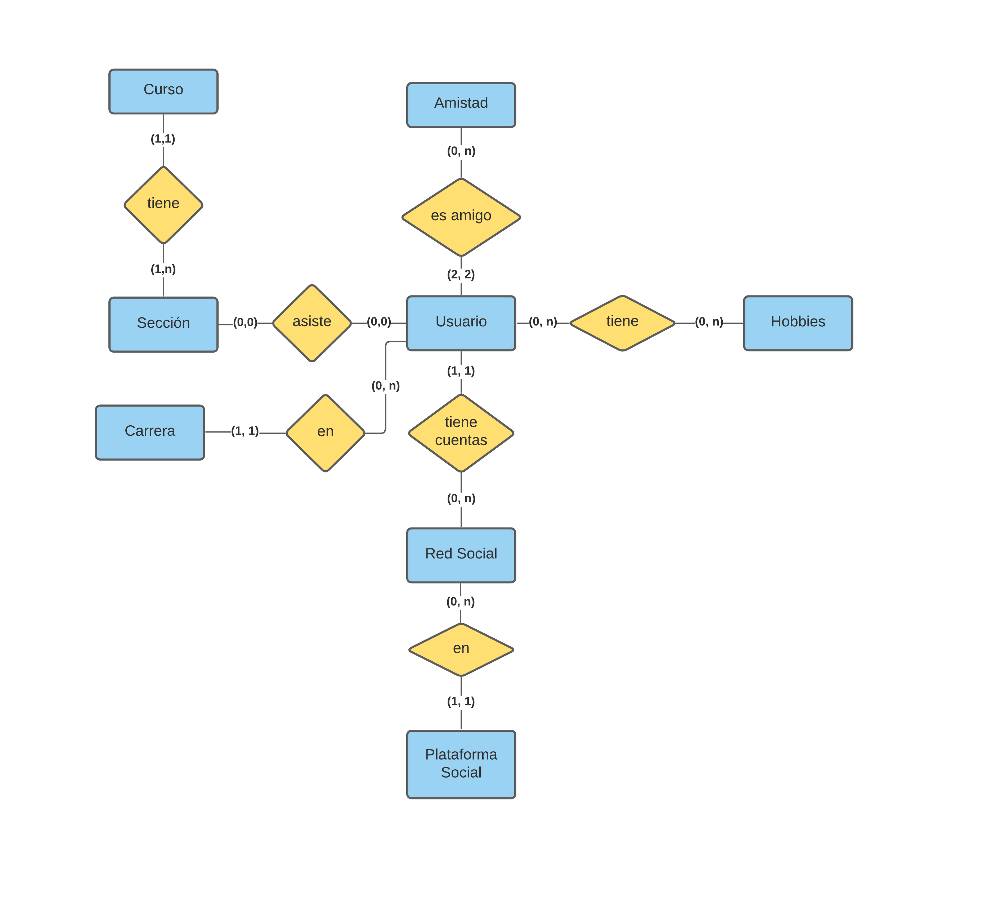

# Backend
El proyecto utiliza un backend de Django y postgresql. Actualmente está hecho con SQLite solo para facilitar el 
development, pero ya fue probado con Postgresql y es funcional con ella.

## Setup
1. Instalar Postgresql (o SQLite)
2. Instalar Python
3. Instalar pip si es necesario
4. Crear un python venv
5. Instalar requirements.txt
6. Crear el environment
7. Migrate
8. Correr el api

### Detalles
En la instalación se usará `python3` y `pip3` asumiendo que esto será deployado en una máquina Linux. Para el resto 
de sistemas operativos solo es necesario usar `python` y `pip`.

### Virtual Environment
El virtual environment de Python nos permite asegurarnos de que no hay una tercera dependencia que afecte cómo funciona el proyecto.
```bash
python3 -m venv venv
source venv/bin/activate  # On Windows use `env\Scripts\activate`
```

### Dependencias
Por el momento, todas las dependencias están en dependencies.txt.
```bash
pip3 install -r requirements.txt
```

### Crear el environment
El archivo env tiene todos los datos que no deberían estar en el repo porque son privadas. Debe tener el nombre .env
y el contenido de ejemplo es algo como:
```bash
DEBUGGING=True
SECRET_KEY=secret-django-key
USE_POSTGRESQL=False
DATABASE_NAME=ISW
DATABASE_USERNAME=postgres
DATABASE_PASSWORD=postgres
DATABASE_HOST=localhost
DATABASE_PORT=5432
```

### Migrate
Migrar nos permite mover todos nuestros modelos de Django a tablas de nuestro motor de base de datos.
```bash
python3 manage.py migrate
```

## Schema de la base de datos

---
### Curso
- *id*
- nombre

### Carrera
- *id*
- nombre

### Usuario
- *id*
- nombre
- apellido
- carrera_id 

### Amistad
- *id*
- amigo1_id: FK a Usuario
- amigo2_id: FK a Usuario

### Hobby
- *id*
- nombre
- descripción

### Plataforma Social
- *id*
- nombre
- base_link: i.e. facebook.com
- profile_link: i.e. facebook.com/{username}

### Red Social
- *id*
- plataforma_id: FK a plataforma social
- usuario_id: FK al usuario que pertenece
