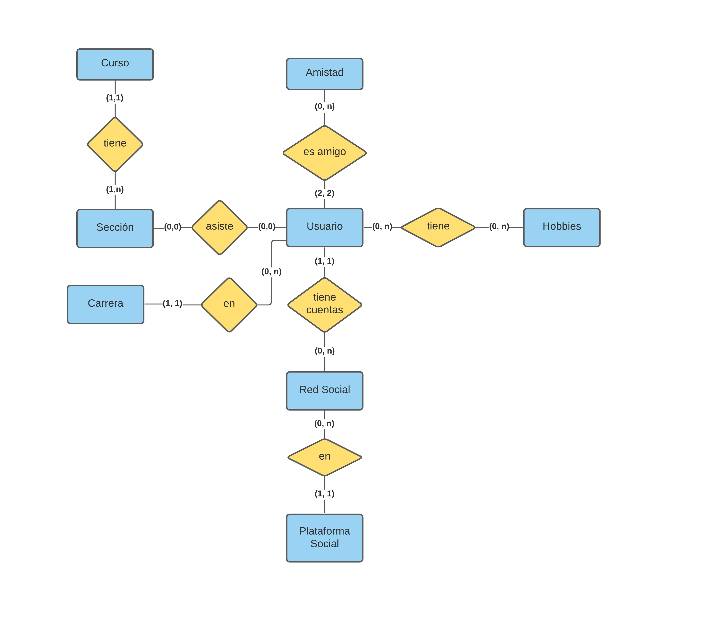

# Backend
El proyecto utiliza un backend de Node y postgresql. Si quieres leer la **[documentación](doc/README.md)**, puedes verlo 
**[aquí](doc/README.md)**.

## Setup
1. Instalar Postgresql y Node
2. Peparar la base de datos
3. npm install
4. Conseguir el .env
5. Correr el api

### 2. Preparar la base de datos
Hasta el momento, solo es necesario correr setup.sql

### 3. Dependencias
Al estar hecho en Node, podemos aprovecharnos de npm para usar todas las dependencias.
```bash
npm install
```

### 4. Conseguir el .env
El archivo .env contiene las claves de la base de datos y todo. **No debe estar en el repositorio.**
Puedes sustituir los datos con los que desees, no necesariamente los del servidor. Su estructura es así:
```bash
# Para la base de datos
DATABASE_HOST=localhost
DATABASE_USERNAME=postgres
DATABASE_PASSWORD=postgres
DATABASE_NAME=postgres

# Para enviar correos
EMAIL=ejemplo@gmail.com
EMAIL_CLIENT_ID=token
EMAIL_CLIENT_SECRET=token
EMAIL_REFRESH_TOKEN=token
RECEIVER_EMAIL_DOMAIN=@gmail.com

# Tokens para jwt
AUTH_TOKEN_KEY=token
RESET_PASSWORD_TOKEN_KEY=token
VERIFY_ACCOUNT_TOKEN_KEY=token
```

### 5. Correr el api
Dependiendo del entorno donde lo estemos corriendo se utiliza:
```bash
# En testing, una máquina local.
npm run run

# Para producción se utiliza este
npm run start
```

## Schema de la base de datos

---
### Curso
- *id*
- nombre

### Sección
- *id*
- sección
- curso_id: FK a Curso

### Carrera
- *id*
- nombre

### Usuario
- *carne*
- nombre
- apellido
- carrera_id 
- password
- correo

### Amistad
- amigo1_carne: FK a Usuario
- amigo2_carne: FK a Usuario

### Hobby
- *id*
- nombre
- descripción

### Plataforma Social
- *id*
- nombre

### Red Social
- plataforma_id: FK a plataforma social
- usuario_carne: FK al usuario que pertenece
